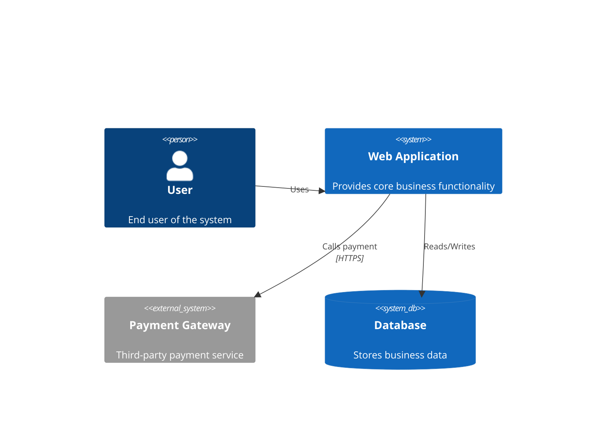

# Mermaid Diagram Generation

Generate diagrams based on text syntax, directly renderable on platforms that support Mermaid such as GitHub, Notion, and Obsidian.

## Use Cases

Use when users need to draw diagrams, create flowcharts, draw architecture diagrams, create sequence diagrams, draw Gantt charts, create class diagrams, make mind maps, draw state machines, generate ER diagrams, create pie charts, draw user journey maps, make Git branch diagrams, or draw C4 architecture diagrams.

## Supported Diagram Types Quick Reference

| Type | Syntax Keyword | Purpose |
|------|---------------|---------|
| Flowchart | `flowchart` / `graph` | Processes, decisions, logical branches |
| Sequence Diagram | `sequenceDiagram` | API calls, message interactions, system communication |
| Class Diagram | `classDiagram` | OOP design, data models, interface relationships |
| State Diagram | `stateDiagram-v2` | State machines, lifecycles, workflow states |
| ER Diagram | `erDiagram` | Database table relationships, entity modeling |
| Gantt Chart | `gantt` | Project scheduling, milestones, task dependencies |
| Pie Chart | `pie` | Proportions, data composition |
| User Journey | `journey` | User experience maps, scenario paths |
| Git Graph | `gitGraph` | Branch strategies, commit history |
| Mind Map | `mindmap` | Knowledge structures, brainstorming organization |
| Timeline | `timeline` | Historical evolution, milestone timelines |
| Sankey Diagram | `sankey` | Traffic flows, energy transfers |
| C4 Architecture | `C4Context` etc. | System context, container diagrams (requires `-- C4` plugin) |
| Quadrant Chart | `quadrantChart` | Two-dimensional four-quadrant analysis |
| Block Diagram | `block` | Block diagrams |

## Output Specifications

Follow these specifications when generating Mermaid code:

1. **Wrap in ` ```mermaid ` code blocks** for direct rendering
2. **Prefer `flowchart` over `graph`** (`graph` is deprecated)
3. **Use semantic node IDs** (e.g., `userLogin` instead of `A`)
4. **Add comments for complex diagrams** (`%% comment content`)
5. **Wrap Chinese nodes in quotes** (e.g., `Start["Start"]`)
6. **Provide both concise and full versions** for the user to choose from
7. **Define styles centrally with `classDef`** rather than scattering inline styles

## Syntax Highlights by Type

### Flowchart `flowchart`

```
flowchart TD
    Start["Start"] --> Input[/"Input Data"/]
    Input --> Check{"Validation Passed?"}
    Check -->|Yes| Process["Process Data"]
    Check -->|No| Error["Error"]
    Process --> Output[/"Output Results"/]
    Output --> End["End"]
```

Node Shape Quick Reference:
```
["Rectangle"]        (/Parallelogram/)       ["Rounded Rectangle"]
(("Circle"))      {"Diamond"}            [["Subroutine"]]
[("Database")]     >"Tag"]               ((("Double Circle"))
```

Directions: `TD`(top→down) `LR`(left→right) `BT`(bottom→top) `RL`(right→left)

### Sequence Diagram `sequenceDiagram`

```
sequenceDiagram
    actor U as User
    participant F as Frontend
    participant B as Backend
    participant D as Database

    U->>F: Click Login
    F->>B: POST /api/login
    B->>D: Query User
    D-->>B: Return User Data
    B-->>F: Return Token
    F-->>U: Redirect to Home
```

Arrow Types: `->>` solid `-->>` dashed `->` no arrowhead `-->` dashed no arrowhead `-x` cross tail `-)` async

Activation: `activate B` / `deactivate B`
Notes: `Note right of B: Description`
Loops: `loop condition ... end`
Conditions: `alt condition ... else condition ... end`
Parallel: `par parallel1 ... and parallel2 ... end`

### Gantt Chart `gantt`

```
gantt
    title Project Schedule
    dateFormat YYYY-MM-DD

    section Design
    Requirements Analysis    :done, req, 2026-01-06, 5d
    UI Design                :active, ui, after req, 7d

    section Development
    Backend Development      :dev1, after ui, 14d
    Frontend Development     :dev2, after ui, 14d

    section Testing
    Integration Testing      :crit, test, after dev1, 5d
    Milestone                :milestone, m1, 2026-02-15, 0d
```

Status Markers: `done` `active` `crit` `milestone`
Date Formats: `YYYY-MM-DD`, `after <taskId>`, `<N>d`

### Class Diagram `classDiagram`

```
classDiagram
    class Animal {
        +String name
        +int age
        +makeSound() void
    }
    class Dog {
        +String breed
        +fetch() void
    }
    class Cat {
        +String color
        +purr() void
    }

    Animal <|-- Dog : Inheritance
    Animal <|-- Cat : Inheritance
```

Relationships: `<|--` inheritance, `*--` composition, `o--` aggregation, `-->` association, `..>` dependency, `..|>` realization
Visibility: `+` public, `-` private, `#` protected, `~` package

### State Diagram `stateDiagram-v2`

```
stateDiagram-v2
    [*] --> PendingPayment
    PendingPayment --> Paid : Payment Successful
    PendingPayment --> Cancelled : Timeout/Manual Cancel
    Paid --> Shipped : Warehouse Dispatch
    Shipped --> Completed : Confirm Receipt
    Shipped --> Returning : Request Return
    Returning --> Refunded : Refund Complete
    Cancelled --> [*]
    Completed --> [*]
    Refunded --> [*]

    state Paid {
        [*] --> Pending
        Pending --> Processing
        Processing --> [*]
    }
```

### ER Diagram `erDiagram`

```
erDiagram
    USER {
        int id PK
        string name
        string email UK
    }
    ORDER {
        int id PK
        int userId FK
        float amount
        datetime createdAt
    }
    USER ||--o{ ORDER : "places"
```

Relationships: `||--||` one-to-one, `||--o{` one-to-many, `}o--o{` many-to-many, `||--o|` one-to-one-or-zero

### Pie Chart `pie`

```
pie
    title User Source Distribution
    "Search Engine" : 45.2
    "Direct Visit" : 28.7
    "Social Media" : 15.3
    "Email Marketing" : 10.8
```

### Mind Map `mindmap`

```
mindmap
  root((Project Architecture))
    Frontend
      React
      State Management
      UI Component Library
    Backend
      API Gateway
      Microservices
        User Service
        Order Service
      Database
        MySQL
        Redis
    DevOps
      Docker
      CI/CD
```

Indentation depth determines hierarchy. Shapes: `(())` circle, `[])` rounded, `))` cloud, `))` bang, `{{}}` hexagon

### Timeline `timeline`

```
timeline
    title Project Milestones
    2024-Q1 : Project Launch : Tech stack finalized
    2024-Q2 : MVP Development : Core features live
    2024-Q3 : Beta Testing : Collect user feedback
    2024-Q4 : Official Release : Marketing push begins
```

### User Journey `journey`

```
journey
    title User Shopping Journey
    section Discovery
      Browse Homepage: 4: User
      Search Products: 3: User
    section Decision
      View Details: 5: User
      Compare Prices: 2: User
    section Purchase
      Add to Cart: 5: User
      Complete Payment: 4: User, System
```

Score range 1-5, participants comma-separated.

### Git Graph `gitGraph`

```
gitGraph
    commit id: "Initial"
    branch develop
    checkout develop
    commit id: "Feature A"
    branch feature/B
    commit id: "Feature B-1"
    commit id: "Feature B-2"
    checkout develop
    merge feature/B
    checkout main
    merge develop tag: "v1.0"
```

### C4 Architecture Diagram



Requires declaring the `-- C4` plugin reference before the code block. More C4 levels: `C4Container`, `C4Component`, `C4Deployment`.

See [references/syntax-reference.md](references/syntax-reference.md) for detailed syntax reference.

## Styles and Themes

### Theme Switching
```
%%{init: {'theme': 'dark'}}%%
%%{init: {'theme': 'forest'}}%%
%%{init: {'theme': 'neutral'}}%%
%%{init: {'theme': 'base', 'themeVariables': { 'primaryColor': '#4a90d9'}}}%%
```

Available themes: `default` `dark` `forest` `neutral` `base`

### Custom classDef (Flowchart/Class Diagram)

```
classDef primary fill:#4a90d9,stroke:#333,color:#fff
classDef danger fill:#e74c3c,stroke:#333,color:#fff
class Start,End primary
class Error danger
```

## Workflow

1. **Clarify Requirements** — Ask: What type of diagram? What relationships/flow to express? How many participants/nodes?
2. **Draft First** — Provide a concise version of the code; confirm the structure is correct
3. **Refine Details** — Complete node names, relationship labels, styling
4. **Output for Rendering** — Wrap in ` ```mermaid `, ready to paste into supported platforms

## Platform Compatibility Notes

- **GitHub/GitLab** — Native support for ` ```mermaid `
- **Notion** — Requires Mermaid plugin or embedding images from mermaid.live
- **Obsidian** — Native support
- **Confluence** — Requires plugin
- **Feishu** — No direct rendering support; export SVG/PNG from mermaid.live and insert
- **WeChat/DingTalk** — Not supported; use live editor to export images